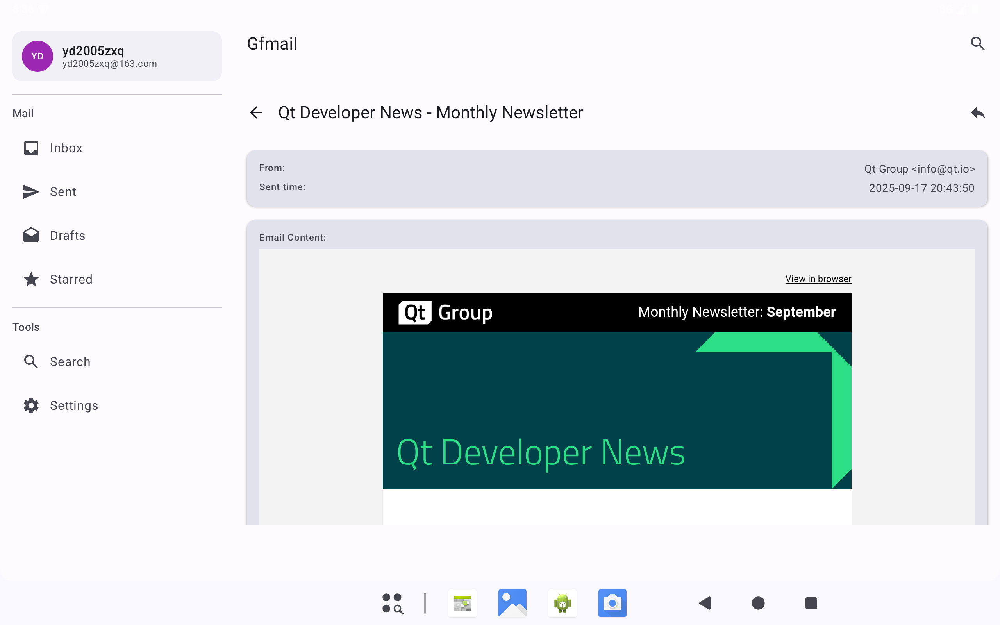
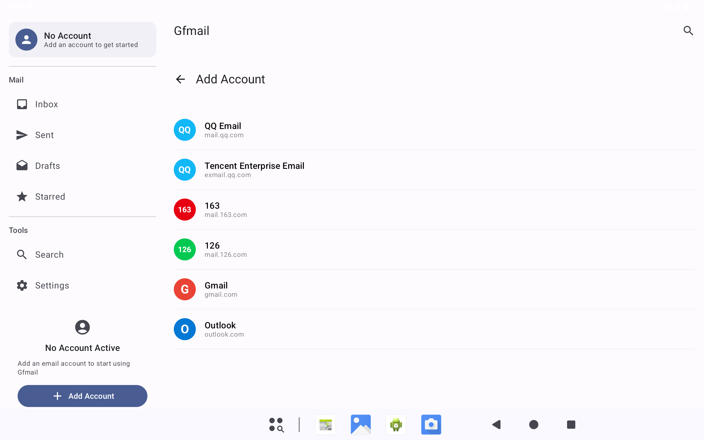

# Gfmail - Android Email Client

[](LICENSE)
[](https://developer.android.com)
[](https://kotlinlang.org)
[](https://android-arsenal.com/api?level=24)

A modern, secure, and feature-rich Android email client built with Kotlin and Jetpack Compose. Gfmail provides a clean, intuitive interface for managing multiple email accounts with support for various email providers.

## ✨ Features

### 🔐 Multi-Provider Support
- **163/126/yeah.net** (NetEase) - Full support with IMAP/SMTP
- **Gmail** - OAuth2 and App Password support
- **QQ Mail** - Authorization code support
- **Outlook/Hotmail** - Modern authentication
- **Yahoo Mail** - IMAP/SMTP support
- **Apple iCloud** - IMAP/SMTP support

### 📧 Email Management
- **HTML Email Rendering** - Full WebView support with dynamic height adjustment
- **Rich Text Support** - Proper HTML parsing and display
- **Image Loading Control** - User-controlled remote image loading for privacy
- **Multi-Encoding Support** - UTF-8, GBK, GB2312 charset detection
- **Email Threading** - Conversation view support
- **Search & Filter** - Advanced email search capabilities

### 🎨 Modern UI/UX
- **Jetpack Compose** - Modern declarative UI
- **Material Design 3** - Latest design guidelines
- **Dark/Light Theme** - Automatic theme switching
- **Responsive Design** - Optimized for all screen sizes
- **Smooth Animations** - Fluid transitions and interactions

### 🔒 Security & Privacy
- **End-to-End Encryption** - Secure email transmission
- **Privacy-First Design** - No tracking, no data collection
- **Secure Authentication** - OAuth2 and modern auth protocols
- **Local Data Storage** - Encrypted local database
- **Network Security** - TLS/SSL encryption

### 🚀 Performance
- **Efficient Sync** - Background email synchronization
- **Offline Support** - Read emails without internet
- **Memory Optimization** - Efficient resource management
- **Fast Rendering** - Optimized WebView performance

## 📱 Screenshots

*Screenshots will be added once the app is built and tested. For now, you can see the app in action by building and running it locally.*

<!-- TODO: Add actual screenshots once app is built
<div align="center">
  
  
  
  
</div>
-->

## 🛠️ Technical Stack

### Core Technologies
- **Kotlin** - Primary programming language
- **Jetpack Compose** - Modern UI toolkit
- **Material Design 3** - Design system
- **Android Architecture Components** - MVVM pattern

### Data Layer
- **Room Database** - Local data persistence
- **Retrofit** - Network communication
- **OkHttp** - HTTP client
- **Gson** - JSON serialization

### Email Protocols
- **IMAP** - Email retrieval
- **SMTP** - Email sending
- **OAuth2** - Modern authentication
- **TLS/SSL** - Secure connections

### UI Components
- **WebView** - HTML email rendering
- **Jsoup** - HTML parsing
- **Lottie** - Animations
- **Coil** - Image loading

## 📋 Requirements

- **Android 7.0 (API 24)** or higher
- **Kotlin 1.9.0** or higher
- **Android Studio Hedgehog** or higher
- **JDK 17** or higher

## 🚀 Getting Started

### Prerequisites

1. **Android Studio** - Download from [developer.android.com](https://developer.android.com/studio)
2. **Git** - For version control
3. **Android SDK** - API 24+ and build tools

### Installation

1. **Clone the repository**
   ```bash
   git clone https://github.com/[YOUR_USERNAME]/gfmail.git
   cd gfmail
   ```

2. **Open in Android Studio**
   - Launch Android Studio
   - Select "Open an existing project"
   - Navigate to the cloned directory

3. **Sync Project**
   - Android Studio will automatically sync Gradle files
   - Wait for the sync to complete

4. **Build and Run**
   ```bash
   ./gradlew assembleDebug
   ```

### Configuration

1. **Email Provider Setup**
   - Gmail: Enable 2FA and generate App Password
   - QQ Mail: Enable IMAP and generate Authorization Code
   - 163/126: Use account password (IMAP enabled by default)

2. **Build Configuration**
   - Update `local.properties` with your Android SDK path
   - Configure signing keys for release builds

## 📖 Usage

### Adding Email Accounts

1. **Launch the app**
2. **Tap "Add Account"**
3. **Select your email provider**
4. **Enter credentials**
5. **Configure server settings** (if needed)
6. **Test connection**

### Reading Emails

1. **Select an account** from the account switcher
2. **Browse email list** with pull-to-refresh
3. **Tap an email** to read
4. **Use "Load Remote Images"** button for HTML emails
5. **Scroll through content** with dynamic height adjustment

### Managing Emails

- **Mark as Read/Unread** - Swipe or long-press
- **Archive** - Swipe left
- **Delete** - Swipe right
- **Search** - Use the search bar
- **Filter** - By date, sender, or subject

## 🏗️ Architecture

Gfmail follows the **MVVM (Model-View-ViewModel)** architecture pattern with clean separation of concerns:

```
app/
├── data/           # Data layer
│   ├── local/      # Room database
│   ├── remote/     # Network services
│   └── repository/ # Data repositories
├── domain/         # Business logic
│   ├── model/      # Domain models
│   └── usecase/    # Use cases
├── presentation/   # UI layer
│   ├── ui/         # Compose UI
│   └── viewmodel/  # ViewModels
└── di/            # Dependency injection
```

### Key Components

- **EmailRepository** - Centralized email data management
- **ImapClient** - IMAP protocol implementation
- **SmtpClient** - SMTP protocol implementation
- **AdvancedHtmlParser** - HTML to text conversion
- **WebViewRenderer** - HTML email display

## 🧪 Testing

### Running Tests

```bash
# Unit tests
./gradlew test

# Instrumented tests
./gradlew connectedAndroidTest

# All tests
./gradlew check
```

### Test Coverage

```bash
# Generate coverage report
./gradlew jacocoTestReport
```

## 📦 Building

### Debug Build
```bash
./gradlew assembleDebug
```

### Release Build
```bash
./gradlew assembleRelease
```

### APK Signing
1. Generate keystore
2. Update `build.gradle.kts` with signing config
3. Build release APK

## 🤝 Contributing

We welcome contributions! Please follow these steps:

1. **Fork the repository**
2. **Create a feature branch**
   ```bash
   git checkout -b feature/amazing-feature
   ```
3. **Make your changes**
4. **Add tests** for new functionality
5. **Commit your changes**
   ```bash
   git commit -m "Add amazing feature"
   ```
6. **Push to the branch**
   ```bash
   git push origin feature/amazing-feature
   ```
7. **Open a Pull Request**

### Development Guidelines

- Follow [Kotlin Coding Conventions](https://kotlinlang.org/docs/coding-conventions.html)
- Use [Material Design 3](https://m3.material.io/) guidelines
- Write unit tests for new features
- Update documentation for API changes
- Follow the existing code style

## 📄 License

This project is licensed under the MIT License - see the [LICENSE](LICENSE) file for details.

## 🙏 Acknowledgments

- **Thunderbird** - Email protocol implementations
- **Android Team** - Jetpack Compose and Architecture Components
- **Material Design Team** - Design system and guidelines

## 📞 Support

- **Issues** - [GitHub Issues](https://github.com/[YOUR_USERNAME]/gfmail/issues)
- **Discussions** - [GitHub Discussions](https://github.com/[YOUR_USERNAME]/gfmail/discussions)
- **Email** - [Create an issue](https://github.com/[YOUR_USERNAME]/gfmail/issues) for support

## 🔮 Roadmap

### Version 2.0
- [ ] Push notifications
- [ ] Email templates
- [ ] Advanced search filters
- [ ] Email scheduling
- [ ] Calendar integration

### Version 2.1
- [ ] Email encryption (PGP)
- [ ] Custom themes
- [ ] Widget support
- [ ] Wear OS companion
- [ ] Desktop companion app

---

<div align="center">
  <p>Made with ❤️ by the Gfmail Team</p>
  <p>
    <a href="https://github.com/[YOUR_USERNAME]/gfmail">⭐ Star us on GitHub</a>
    <span> • </span>
    <a href="https://github.com/[YOUR_USERNAME]/gfmail/issues">🐛 Report Bug</a>
    <span> • </span>
    <a href="https://github.com/[YOUR_USERNAME]/gfmail/discussions">💬 Request Feature</a>
  </p>
</div>